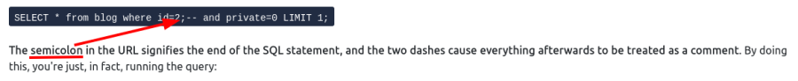

<h1 align='center'>:fire: TryHackMe SQL Injection room :fire: </h1>

 
[SQL Injection Room](https://tryhackme.com/room/sqlinjectionlm)

## Task 1: Breif
### Q: What does SQL stand for?
 
#### A: `Structured Query Language` :heavy_check_mark: 

## Task 2:
### Q: What is the acronym for the software that controls a database?
 
#### A: `DBMS` :heavy_check_mark: 

### Q: What is the name of the grid-like structure which holds the data?
 
#### A: `table` :heavy_check_mark: 

## Task 3:
### Q: What SQL statement is used to retrieve data?
 
#### A: `SELECT` :heavy_check_mark: 

### Q: What SQL clause can be used to retrieve data from multiple tables?
 
#### A: `UNION` :heavy_check_mark: 

### Q: What SQL statement is used to add data?
 
#### A: `INSERT` :heavy_check_mark: 

## Task 4:
### Q: What character signifies the end of an SQL query?
 
#### A: `;` :heavy_check_mark: 