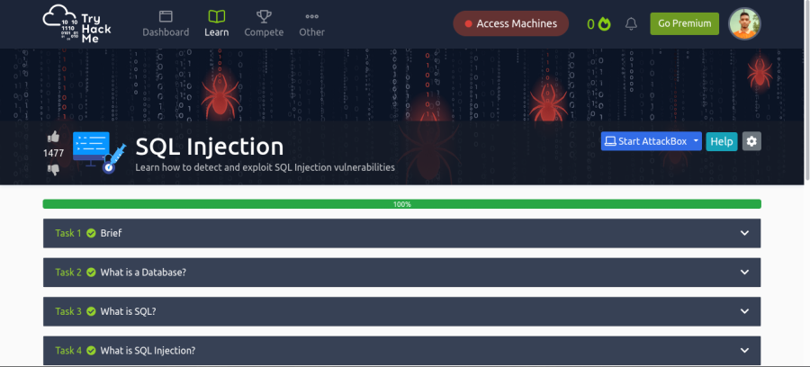
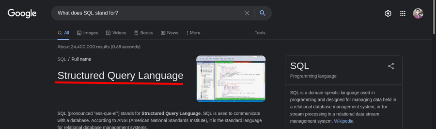

<h1 align='center'>:fire: TryHackMe SQL Injection room :fire: </h1>

 
[SQL Injection Room](https://tryhackme.com/room/sqlinjectionlm)

## Task 1: Breif
### Q: What does SQL stand for?
 
### A: `Structured Query Language`